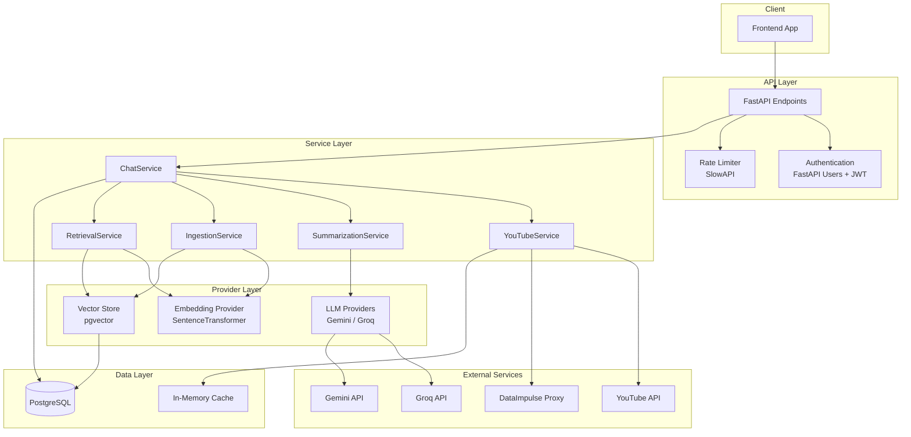

# Architecture Overview

This document provides a high-level overview of the YouTube Playlist Summarizer backend architecture.

## System Architecture

## Core Components

| Component | Purpose | Key Files |
|-----------|---------|-----------|
| **API Layer** | HTTP endpoints, auth, rate limiting | `app/api/endpoints.py`, `app/api/auth.py` |
| **ChatService** | Orchestrates summarization and chat | `app/services/chat.py` |
| **YouTubeService** | Playlist extraction, transcript caching | `app/services/youtube.py` |
| **RAG Pipeline** | Vector indexing and retrieval | `app/services/ingestion.py`, `app/services/retrieval.py` |
| **LLM Providers** | Model-agnostic AI abstraction | `app/core/providers/` |
| **Database** | PostgreSQL with pgvector | `app/models/sql.py`, `alembic/` |

## Request Flow

### Summarization Flow

1. **Request** → `POST /api/v1/summarize` with playlist URL
2. **Extract** → `YouTubeService` fetches playlist metadata via yt-dlp
3. **Transcripts** → Fetch/cache video transcripts from YouTube
4. **Summarize** → `SummarizationService` uses Map-Reduce pattern
5. **Index** → `IngestionService` chunks and embeds transcripts into pgvector
6. **Store** → Save conversation and summary to database
7. **Response** → Return summary with conversation ID

### Chat Flow

1. **Request** → `POST /api/v1/chat` with message and conversation ID
2. **Retrieve** → `RetrievalService` transforms query and searches pgvector
3. **Context** → Build prompt with retrieved chunks + summary
4. **Generate** → `LLMProvider` generates response
5. **Store** → Save message pair to database
6. **Response** → Return AI response

## Design Principles

- **Model-Agnostic**: Abstract provider interfaces allow swapping LLMs/embeddings
- **Async-First**: All I/O operations are async for high concurrency
- **Caching**: Transcripts cached in PostgreSQL to minimize YouTube API calls
- **RAG-Enhanced**: Vector search provides relevant context for chat responses
- **Rate Limited**: Prevents abuse with per-endpoint rate limiting
