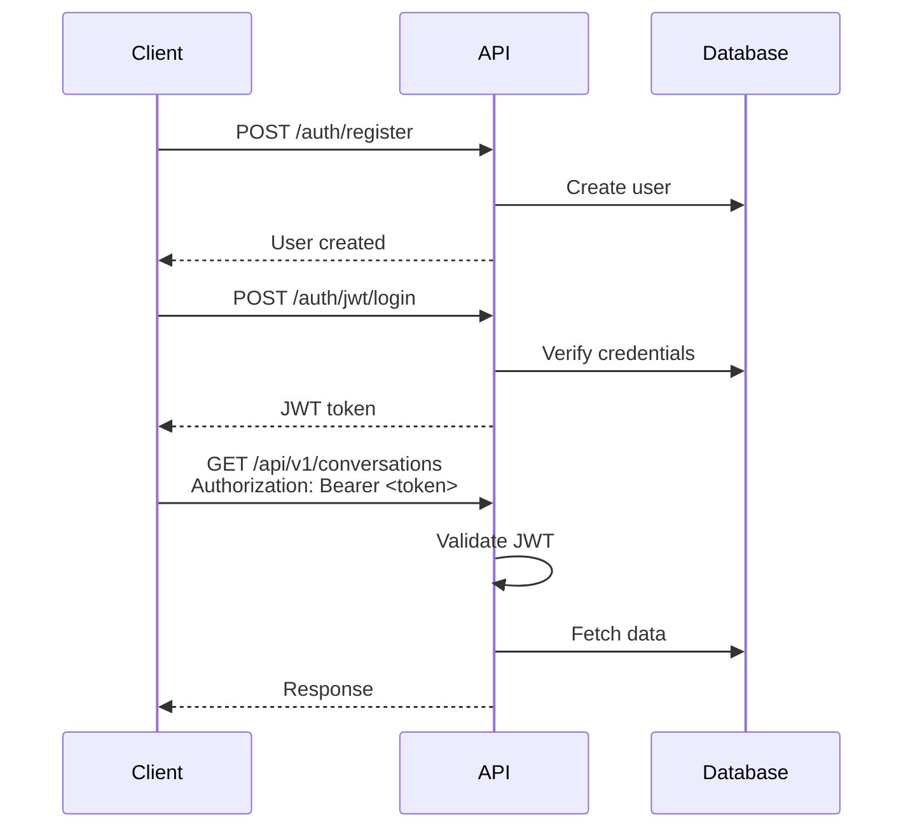

# Authentication

The application uses [FastAPI Users](https://fastapi-users.github.io/) for authentication with JWT tokens.

## Overview



## Endpoints

### Register

```http
POST /auth/register
Content-Type: application/json

{
  "email": "user@example.com",
  "password": "securepassword123"
}
```

**Response:** `201 Created`
```json
{
  "id": "uuid",
  "email": "user@example.com",
  "is_active": true,
  "is_superuser": false,
  "is_verified": false
}
```

### Login

```http
POST /auth/jwt/login
Content-Type: application/x-www-form-urlencoded

username=user@example.com&password=securepassword123
```

**Response:**
```json
{
  "access_token": "eyJhbGciOiJIUzI1NiIs...",
  "token_type": "bearer"
}
```

### Logout

```http
POST /auth/jwt/logout
Authorization: Bearer <token>
```

### Get Current User

```http
GET /users/me
Authorization: Bearer <token>
```

**Response:**
```json
{
  "id": "uuid",
  "email": "user@example.com",
  "is_active": true,
  "is_superuser": false,
  "is_verified": false
}
```

## Configuration

| Variable | Description |
|----------|-------------|
| `SECRET_KEY` | JWT signing secret (required) |

## User Model

```python
class User(SQLAlchemyBaseUserTableUUID, Base):
    __tablename__ = "users"
    # Inherits: id, email, hashed_password, is_active, is_superuser, is_verified
```

## Protected Endpoints

Use dependency injection to require authentication:

```python
from app.api.auth import current_active_user
from app.models.sql import User

@router.get("/protected")
async def protected_route(user: User = Depends(current_active_user)):
    return {"user_id": str(user.id)}
```

For optional authentication (anonymous allowed):

```python
from app.api.auth import current_optional_user

@router.get("/optional")
async def optional_route(user: Optional[User] = Depends(current_optional_user)):
    if user:
        return {"authenticated": True}
    return {"authenticated": False}
```
