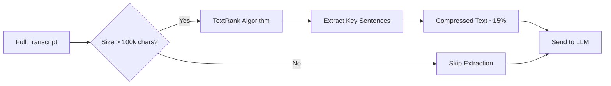

# Extractive Summarization

The **Extractive Summarization** module (`app/services/extractive.py`) provides a **zero-LLM-cost** preprocessing step that reduces transcript volume before sending to LLM APIs. This is critical for handling long videos like podcasts (2+ hours) that exceed LLM token limits.

## Why Use Extractive Summarization?

| Problem | Solution |
|---------|----------|
| **HTTP 413 Payload Too Large** | Reduce text to 15% of original |
| **Rate Limits (TPM)** | Fewer tokens = more requests within limits |
| **API Costs** | Less input tokens = lower cost |
| **Long Podcasts** | 2-hour video (180k chars) → 27k chars |

## How It Works



### TextRank Algorithm

The module uses the **TextRank** algorithm (similar to Google's PageRank) to identify the most important sentences:

1. **Build graph** - Each sentence is a node
2. **Calculate similarity** - Edges weighted by sentence similarity
3. **Rank sentences** - PageRank-style voting for importance
4. **Select top sentences** - Keep highest-ranked sentences

This is **deterministic** (same input = same output) and requires **no API calls**.

## Configuration

Located in `app/core/constants.py`:

```python
class ExtractiveSummaryConfig:
    SENTENCES_PER_VIDEO = 50       # Max sentences to extract per video
    FALLBACK_SENTENCE_COUNT = 30   # When language tokenizer not supported
    MIN_TEXT_LENGTH = 500          # Skip extraction for short texts
    COMPRESSION_RATIO = 0.15       # Target 15% of original content
    ACTIVATION_THRESHOLD = 100_000 # Only activate for texts > 100k chars
```

| Parameter | Value | Description |
|-----------|-------|-------------|
| `COMPRESSION_RATIO` | 0.15 | Target 15% of original text |
| `ACTIVATION_THRESHOLD` | 100,000 chars | ~25k tokens threshold |
| `SENTENCES_PER_VIDEO` | 50 | Maximum sentences to extract |

## Multi-Language Support

The module supports 18+ languages through NLTK tokenizers:

| Supported | Languages |
|-----------|-----------|
| Full NLTK Support | English, Czech, German, French, Spanish, Italian, Portuguese, Russian, Polish, Dutch, Swedish, Norwegian, Danish, Finnish, Greek, Turkish, Estonian, Slovene |
| Fallback (regex) | Any other language (Japanese, Chinese, etc.) |

Language detection uses `pycountry` to convert ISO 639-1/639-2 codes (e.g., `en`, `cs`, `pt-BR`) to NLTK language names.

## Usage in Summarization Pipeline

The `SummarizationService` automatically applies extractive compression when needed:

```python
# In summarization.py
def _should_apply_extraction(self, total_chars: int) -> bool:
    """Check if extractive pre-processing should be applied."""
    if self.extractive_summarizer is None:
        return False
    return total_chars >= ExtractiveSummaryConfig.ACTIVATION_THRESHOLD
```

The flow:
1. Calculate total transcript size
2. If > 100k chars, apply extractive compression
3. Compressed videos replace originals for LLM processing
4. LLM receives ~15% of original content

## Example Output

**Before extraction (2-hour podcast, 177k chars):**
```
Total transcript volume: 177,473 chars across 1 videos
```

**After extraction:**
```
Applying extractive compression (ratio=0.15)
After extraction: 26,621 chars
```

Result: **85% reduction** in token usage while preserving key content.

## API

### ExtractiveSummarizer Class

```python
from app.services.extractive import ExtractiveSummarizer

summarizer = ExtractiveSummarizer()

# Extract key sentences from text
key_sentences = summarizer.extract_key_sentences(
    text="...",
    language="en",  # Optional, auto-detects from video
    sentence_count=50  # Optional
)

# Compress multiple videos
compressed_videos = summarizer.compress_transcripts(
    videos=videos,
    target_ratio=0.15
)
```

### Methods

| Method | Description |
|--------|-------------|
| `extract_key_sentences(text, language, sentence_count)` | Extract top sentences from text |
| `compress(text, target_ratio)` | Compress text to target ratio |
| `compress_transcripts(videos, target_ratio)` | Compress list of Video objects |

## Dependencies

The module uses:
- **sumy** - TextRank implementation
- **nltk** - Sentence tokenization (punkt_tab data)
- **pycountry** - ISO language code resolution

These are auto-installed with the project dependencies.

## Limitations

1. **Not semantic** - Extracts verbatim sentences, doesn't paraphrase
2. **May miss context** - Important context between sentences can be lost
3. **Works best for** - Structured content (talks, lectures, interviews)
4. **Less effective for** - Highly conversational or non-linear content

## See Also

- [Summarization Service](summarization.md) - Main summarization logic
- [Optimization Strategies](optimization-strategies.md) - Full optimization approach
- [Configuration](configuration.md) - Environment variables
