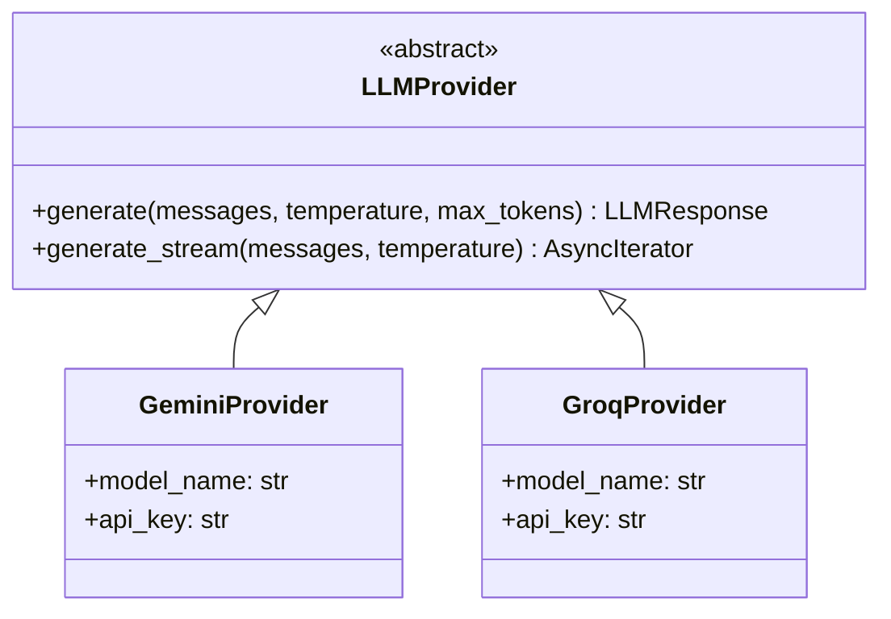

# LLM Providers

The application uses a provider abstraction layer for model-agnostic AI integration.

## Architecture



## Available Providers

| Provider | Use Case | Model | Speed | Notes |
|----------|----------|-------|-------|-------|
| **Groq** | Summarization | Llama 4 Scout | Very fast | Best for batch processing |
| **Gemini** | Chat | Gemini 2.5 Flash | Fast | Best for interactive chat |

## LLMProvider Interface

```python
from abc import ABC, abstractmethod
from pydantic import BaseModel

class LLMMessage(BaseModel):
    role: str  # "system", "user", "assistant"
    content: str

class LLMResponse(BaseModel):
    content: str
    usage: dict  # token counts

class LLMProvider(ABC):
    @abstractmethod
    async def generate(
        self,
        messages: list[LLMMessage],
        temperature: float = 0.7,
        max_tokens: int = 4096,
    ) -> LLMResponse:
        """Generate a response from the LLM."""
        pass
```

## GeminiProvider

Uses the Google Generative AI SDK.

```python
from app.core.providers import GeminiProvider

provider = GeminiProvider(
    model_name="gemini-2.5-flash",
    api_key="AIza..."
)

response = await provider.generate([
    LLMMessage(role="user", content="Hello!")
])
print(response.content)
```

## GroqProvider

Uses the Groq SDK for fast Llama inference.

```python
from app.core.providers import GroqProvider

provider = GroqProvider(
    model_name="meta-llama/llama-4-scout-17b-16e-instruct",
    api_key="gsk_..."
)

response = await provider.generate([
    LLMMessage(role="system", content="You are a helpful assistant."),
    LLMMessage(role="user", content="Summarize this text...")
])
```

## Dependency Injection

Providers are instantiated via dependency injection:

```python
# app/api/dependencies.py

@lru_cache
def get_chat_llm_provider() -> LLMProvider:
    return GeminiProvider(
        model_name=settings.GEMINI_MODEL_NAME,
        api_key=settings.GEMINI_API_KEY,
    )

@lru_cache
def get_summary_llm_provider() -> LLMProvider:
    return GroqProvider(
        model_name=settings.GROQ_MODEL_NAME,
        api_key=settings.GROQ_API_KEY,
    )
```

## Adding a New Provider

1. Create `app/core/providers/my_provider.py`:

```python
from app.core.providers.llm_provider import LLMProvider, LLMMessage, LLMResponse

class MyProvider(LLMProvider):
    def __init__(self, api_key: str, model_name: str):
        self.api_key = api_key
        self.model_name = model_name
    
    async def generate(
        self,
        messages: list[LLMMessage],
        temperature: float = 0.7,
        max_tokens: int = 4096,
    ) -> LLMResponse:
        # Implement your provider logic
        pass
```

2. Export in `app/core/providers/__init__.py`
3. Add configuration to `app/core/config.py`
4. Create factory in `app/api/dependencies.py`
