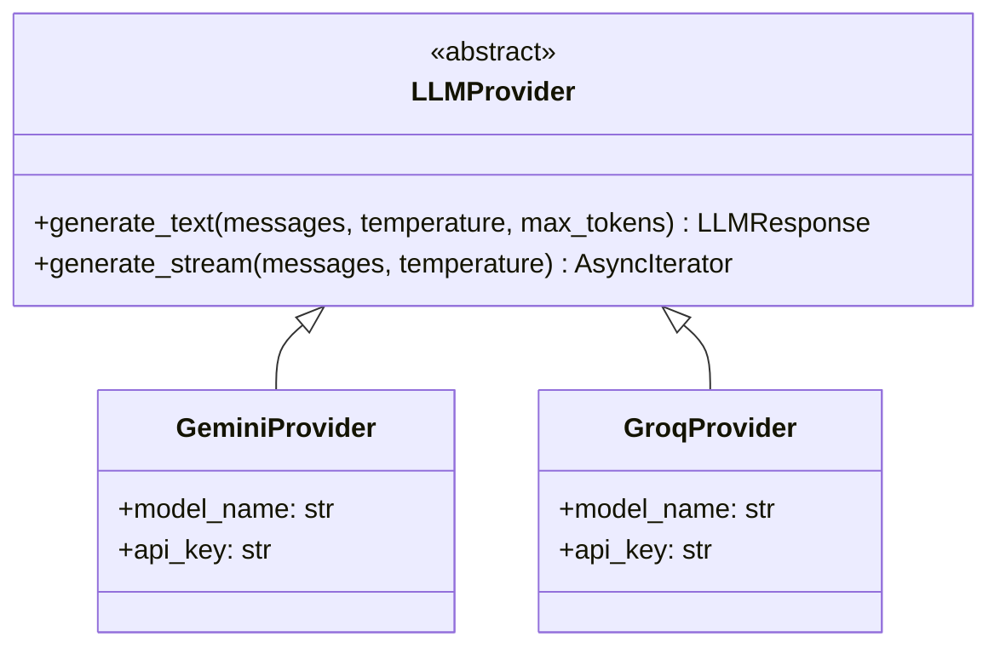

# LLM Providers

The application uses a provider abstraction layer for model-agnostic AI integration.

## Architecture



## Available Providers

| Provider | Use Case | Speed | Notes |
|----------|----------|-------|-------|
| **Groq** | Summarization | Very fast | Best for batch processing |
| **Gemini** | Chat | Fast | Best for interactive chat |

## Core Types

### LLMRole Enum

Type-safe message roles for LLM communication:

```python
from app.models.enums import LLMRole

class LLMRole(str, Enum):
    SYSTEM = "system"      # System instructions
    USER = "user"          # User messages
    ASSISTANT = "assistant" # Model responses
```

### LLMMessage

Vendor-neutral message format:

```python
from app.core.providers.llm_provider import LLMMessage
from app.models.enums import LLMRole

message = LLMMessage(
    role=LLMRole.USER,  # Type-safe enum value
    content="Hello!"
)
```

### LLMResponse

Standardized response from providers:

```python
class LLMResponse(BaseModel):
    content: str
    model: str
    usage: Optional[dict[str, int]] = None  # Token counts
```

## Usage Example

```python
from app.core.providers import GeminiProvider
from app.core.providers.llm_provider import LLMMessage
from app.models.enums import LLMRole

provider = GeminiProvider(
    model_name="your-model-name",
    api_key="AIza..."
)

response = await provider.generate_text([
    LLMMessage(role=LLMRole.SYSTEM, content="You are a helpful assistant."),
    LLMMessage(role=LLMRole.USER, content="Hello!"),
])
print(response.content)
```

## GeminiProvider

Uses the Google Generative AI SDK.

```python
from app.core.providers import GeminiProvider

provider = GeminiProvider(
    model_name="your-model-name",
    api_key="AIza..."
)
```

## GroqProvider

Uses the Groq SDK for fast Llama inference.

```python
from app.core.providers import GroqProvider

provider = GroqProvider(
    model_name="your-model-name",
    api_key="gsk_..."
)
```

## Dependency Injection

Providers are instantiated via dependency injection:

```python
# app/api/dependencies.py

@lru_cache
def get_chat_llm_provider() -> LLMProvider:
    return GeminiProvider(
        model_name=settings.GEMINI_MODEL_NAME,
        api_key=settings.GEMINI_API_KEY,
    )

@lru_cache
def get_summary_llm_provider() -> LLMProvider:
    return GroqProvider(
        model_name=settings.GROQ_MODEL_NAME,
        api_key=settings.GROQ_API_KEY,
    )
```

## Adding a New Provider

1. Create `app/core/providers/my_provider.py`:

```python
from app.core.providers.llm_provider import LLMProvider, LLMMessage, LLMResponse
from app.models.enums import LLMRole

class MyProvider(LLMProvider):
    def __init__(self, api_key: str, model_name: str):
        self.api_key = api_key
        self.model_name = model_name
    
    async def generate_text(
        self,
        messages: list[LLMMessage],
        temperature: float = 0.7,
        max_tokens: Optional[int] = None,
    ) -> LLMResponse:
        # Convert messages to your API format
        for msg in messages:
            if msg.role == LLMRole.SYSTEM:
                # Handle system message
                pass
            elif msg.role == LLMRole.USER:
                # Handle user message
                pass
            elif msg.role == LLMRole.ASSISTANT:
                # Handle assistant message
                pass
        
        # Call your API and return response
        return LLMResponse(
            content="...",
            model=self.model_name,
            usage={"prompt_tokens": 10, "completion_tokens": 20, "total_tokens": 30}
        )
```

2. Export in `app/core/providers/__init__.py`
3. Add configuration to `app/core/config.py`
4. Create factory in `app/api/dependencies.py`
