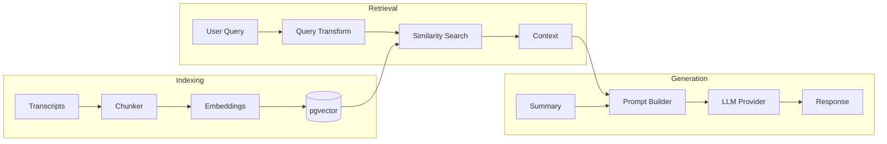

# RAG Pipeline

The Retrieval-Augmented Generation (RAG) pipeline enables context-aware chat by indexing video transcripts and retrieving relevant chunks for each query.

## Overview



## Components

### TranscriptChunker

Splits transcripts into overlapping chunks while preserving timestamp metadata.

```python
from app.services.chunking import TranscriptChunker

chunker = TranscriptChunker(
    chunk_size=1000,        # Target characters per chunk
    chunk_overlap=200,      # Overlap between chunks
)
chunks = chunker.chunk_transcript(video)
```

**Output per chunk:**
- `id`: `{video_id}_{chunk_index}`
- `content`: Text content
- `metadata`: `{video_id, video_title, start_time, end_time}`

### IngestionService

Orchestrates the chunking → embedding → storage pipeline.

```python
from app.services.ingestion import IngestionService

service = IngestionService(embedding_provider, vector_store, chunker)
count = await service.ingest_playlist(videos, namespace="playlist_url")
```

**Features:**
- Batch embedding generation (default: 32 per batch)
- Automatic namespace assignment for playlist grouping
- Error handling with partial success support

### RetrievalService

Transforms queries and retrieves relevant context.

```python
from app.services.retrieval import RetrievalService

service = RetrievalService(embedding_provider, vector_store, llm_provider)
results = await service.retrieve(query, namespace, chat_history, top_k=5)
```

**Query Transformation:**
- Converts follow-up questions to standalone queries
- Uses chat history for context resolution
- Example: "What did he say about that?" → "What did the speaker say about journaling techniques?"

## Provider Abstraction

### EmbeddingProvider

Abstract interface for text embeddings.

| Implementation | Model | Dimensions | Notes |
|----------------|-------|------------|-------|
| `SentenceTransformerEmbedding` | `all-MiniLM-L6-v2` | 384 | Local, uses MPS on Apple Silicon |

### VectorStore

Abstract interface for similarity search.

| Implementation | Backend | Index Type | Notes |
|----------------|---------|------------|-------|
| `PgVectorStore` | PostgreSQL + pgvector | HNSW | Cosine similarity |

## Database Schema

```sql
CREATE TABLE document_embeddings (
    id VARCHAR PRIMARY KEY,           -- {video_id}_{chunk_index}
    content TEXT NOT NULL,            -- Chunk text
    embedding vector(384) NOT NULL,   -- pgvector type
    chunk_metadata JSONB,             -- {video_id, timestamps, etc.}
    namespace VARCHAR,                -- Playlist URL for grouping
    created_at TIMESTAMP
);

-- HNSW index for fast similarity search
CREATE INDEX ix_document_embeddings_embedding_hnsw
ON document_embeddings USING hnsw (embedding vector_cosine_ops)
WITH (m = 16, ef_construction = 64);
```

## Configuration

| Variable | Default | Description |
|----------|---------|-------------|
| `EMBEDDING_PROVIDER` | `sentence_transformers` | Embedding backend |
| `EMBEDDING_MODEL` | `all-MiniLM-L6-v2` | Model name |
| `VECTOR_STORE` | `pgvector` | Vector database |

## Performance

- **Indexing**: ~1000 chunks/second (batch size 32)
- **Search**: <50ms for top-5 results with HNSW index
- **Memory**: MPS acceleration on Apple Silicon for embeddings
