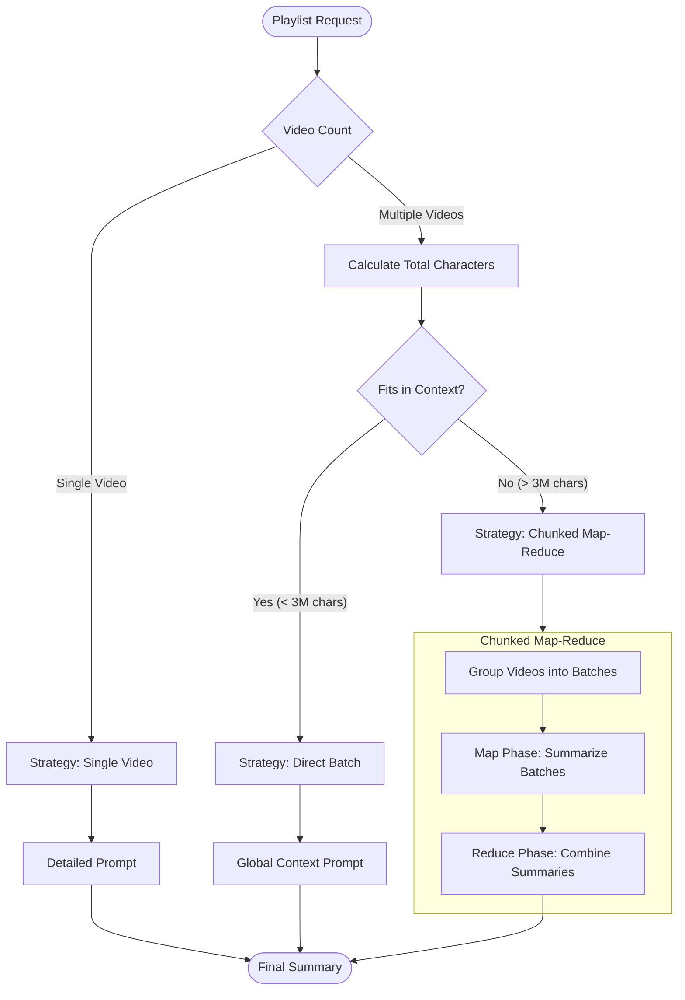

# Summarization Service

The **Summarization Service** (`app/services/summarization.py`) is a core component of the backend responsible for transforming raw video transcripts into coherent, structured summaries. 

It implements an **Adaptive Strategy** that dynamically selects the most efficient processing method based on the volume of text (transcript length) and the capabilities of the underlying LLM (context window).

## Adaptive Strategy Overview

The service analyzes the input playlist and selects one of three execution paths to optimize for **quality**, **speed**, and **cost**.

## Strategies

### 1. Single Video Strategy
**Trigger:** Playlist contains exactly one video.

*   **Logic:** The system bypasses all batching logic and treats the content as a standalone entity.
*   **Prompting:** Uses a highly detailed prompt specifically designed to extract deep insights, timestamps (implicitly), and key takeaways from a single source.
*   **Truncation:** Safety limit of ~2M characters (approx. 500k tokens).

### 2. Direct Batch Strategy (Preferred)
**Trigger:** Multiple videos, total length < `MAX_BATCH_CONTEXT_CHARS` (approx. 750k tokens / 3M chars).

This is the **most efficient method** for modern large-context models (like Gemini 1.5 Pro).

*   **Logic (Context Stuffing):** Concatenates transcripts from *all* videos into a single, massive context window.
*   **Benefits:**
    *   **Cross-Pollination:** The LLM "sees" the entire series at once, allowing it to identify connections, recurring themes, and contradictions between different videos.
    *   **Efficiency:** Only **1 API Request** is made. This reduces network latency and eliminates the repetitive "preamble" cost of multiple system prompts.
*   **Format:** Transcripts are separated by clear headers (`### Video: [Title]`).

### 3. Chunked Map-Reduce Strategy (Fallback)
**Trigger:** Total length > `MAX_BATCH_CONTEXT_CHARS`.

Used for massive datasets (e.g., playlists with hundreds of hours of content) that physically cannot fit into a single context window.

*   **Logic:**
    1.  **Chunking:** Videos are grouped into "batches" (chunks). A chunk is filled until it reaches `MAP_CHUNK_SIZE_CHARS` (~2M chars).
    2.  **Map Phase (Batch Summarization):** Each chunk is sent to the LLM as a "segment" of the playlist.
        *   *Optimization:* Instead of summarizing 1 video per request (standard Map-Reduce), we might summarize 10 short videos in 1 request. This significantly reduces the total number of API calls.
    3.  **Reduce Phase:** The summaries of these chunks are collected and sent to the LLM to generate the final global summary.

## Configuration & Limits

The logic is controlled by constants in `SummarizationService`:

| Constant | Value (Chars) | Approx. Tokens | Description |
| :--- | :--- | :--- | :--- |
| `MAX_SINGLE_VIDEO_CHARS` | 2,000,000 | ~500k | Hard limit for a single video transcript to prevent crashes. |
| `MAX_BATCH_CONTEXT_CHARS` | 3,000,000 | ~750k | Threshold to switch from Direct Batch to Map-Reduce. Leaves buffer for output. |
| `MAP_CHUNK_SIZE_CHARS` | 2,000,000 | ~500k | Target size for a single "chunk" in the Map phase. |

*Note: Token estimates assume ~4 characters per token.*

## Prompt Engineering

The service uses distinct system prompts for each context:

*   **Single Video:** "You are an expert content summarizer... Analyze this video transcript..."
*   **Direct Batch:** "You are analyzing a playlist... provided with full transcripts... structure with Cross-Video Connections..."
*   **Map Phase (Chunk):** "Analyze a segment of a larger playlist... highlight key points of each video..."
*   **Reduce Phase:** "Synthesize multiple summaries into a cohesive global summary..."

## Future Improvements

*   **Parallel Execution:** The Map phase currently runs sequentially (or semi-sequentially via loop) to respect strict Rate Limits. With higher tier API quotas, this can be parallelized using `asyncio.gather`.
*   **Smart Chunking:** Currently chunks are based on character count. Future versions could chunk based on semantic similarity or topic clustering.
