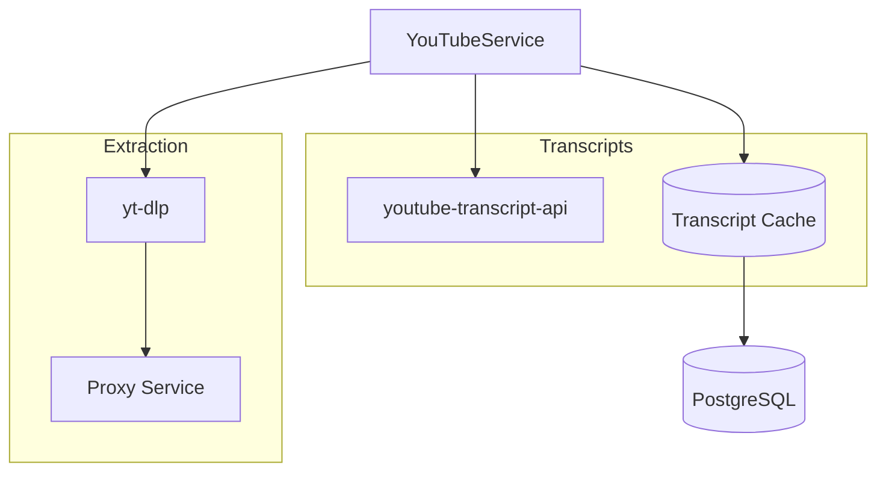
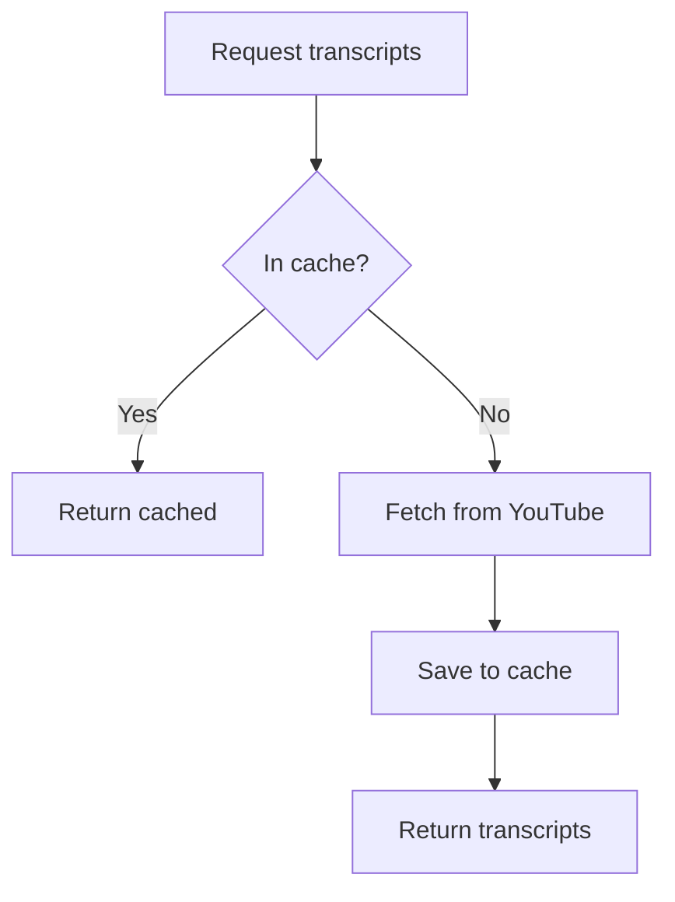

# YouTube Service

The YouTube service handles playlist extraction and transcript fetching with intelligent caching.

## Features

- **Playlist Extraction**: Fetches video metadata using yt-dlp
- **Transcript Fetching**: Retrieves subtitles via youtube-transcript-api
- **Smart Caching**: Stores transcripts in PostgreSQL to minimize API calls
- **Proxy Support**: Routes requests through DataImpulse rotating proxies
- **Concurrency Control**: Limits parallel requests to avoid rate limiting

## Architecture



## Usage

```python
from app.services.youtube import YouTubeService

# Initialize with dependencies
service = YouTubeService(proxy_service, video_repository)

# Extract playlist info
playlist = await service.extract_playlist_info(
    "https://youtube.com/playlist?list=PLxxx"
)

# Fetch transcripts (with caching)
playlist = await service.fetch_transcripts(playlist)

for video in playlist.videos:
    print(f"{video.title}: {len(video.transcript)} segments")
```

## Transcript Priority

The service prioritizes subtitles in this order:

1. **Manual subtitles** (any language) - highest quality
2. **Auto-generated captions** (any language) - fallback

## Caching Strategy



**Cache table:**
```sql
CREATE TABLE videos (
    id VARCHAR PRIMARY KEY,    -- YouTube video ID
    title VARCHAR,
    transcript JSON,           -- Array of segments
    language VARCHAR,
    created_at TIMESTAMP
);
```

## Proxy Configuration

Required for production to avoid IP bans.

| Variable | Description |
|----------|-------------|
| `DATAIMPULSE_HOST` | Proxy hostname |
| `DATAIMPULSE_PORT` | Proxy port |
| `DATAIMPULSE_LOGIN` | Proxy username |
| `DATAIMPULSE_PASSWORD` | Proxy password |

## Concurrency Limits

```python
CONCURRENCY_LIMIT = 5  # Max parallel transcript fetches
```

This prevents overwhelming YouTube's API and proxy infrastructure.

## Error Handling

| Error | Behavior |
|-------|----------|
| `TranscriptsDisabled` | Video skipped, logged as warning |
| `NoTranscriptFound` | Video skipped, returns empty transcript |
| Network timeout | Retried with exponential backoff |

## Data Models

### Playlist
```python
class Playlist(BaseModel):
    title: str
    url: str
    videos: List[Video]
```

### Video
```python
class Video(BaseModel):
    id: str
    title: str
    transcript: Optional[List[TranscriptSegment]]
    
    @property
    def full_text(self) -> str:
        """Concatenated transcript text."""
```

### TranscriptSegment
```python
class TranscriptSegment(BaseModel):
    text: str
    start: float  # Seconds
    duration: float
```
